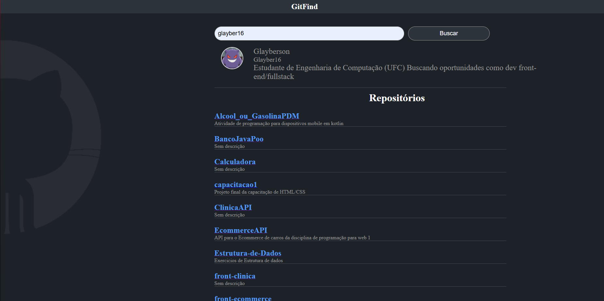

📌 GitHub Profile Finder

É um projeto desenvolvido em React que consome a API pública do GitHub para buscar informações de usuários e seus repositórios.
O objetivo é treinar o uso de hooks, consumo de API e manipulação de estado no React.

🚀 Tecnologias utilizadas
React.js ⚛️

CSS 🎨

API do GitHub 📡
📸 Prévia do Projeto

🔧 Funcionalidades
🔍 Buscar usuários do GitHub pelo username.

👤 Exibir avatar, nome, bio e login do usuário.

📂 Listar todos os repositórios públicos do usuário.

🔗 Redirecionar diretamente para o repositório ao clicar ne
